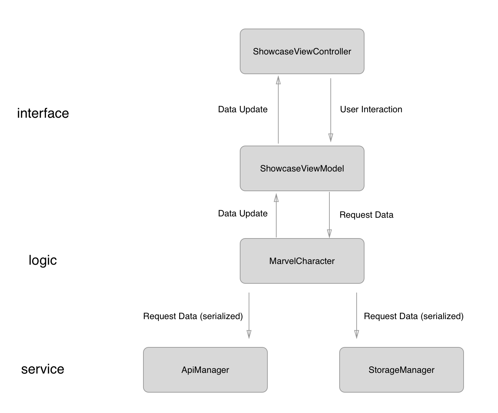

# Avengers - A showcase for those Superheros

This is an app for showcasing Marvel superhero, utilizing Marvel Official API. 

## Feature
* A showcase with pagination
* Simple UI
* Offline Mode
* Using MVVM architecture
* No third party library needed

## Structure

Briefly, the app is composed to three high level layers:  Interface, Logic, Service. The interface layer requests data from Logic layer, and delegates UI interaction to logic layer. The logic layer does all business logic, including decoding JSON to classes/structs, organizing pagination, and doing offline content magics.  The job of service layer is to communicate with API and communicate with local storage. Service layer would not be aware of any high level implementation at all. 

## Model View View Model
The user interface is designed base on the idea of MVVM, model view view model. The view controller is a simply view layer, which won’t do any business logics. Besides, the view controller do not request and update data itself. The data flow is unified, it means that only the view model trigger the update of UI. Beside, UI components that are going to be tested, such as the text in UILabel or the state of a UIButton, would be handled by view model instead of view controller itself.

## Naming convention 
### Postfix
— helper: The extension of existing classes  
— manager: The low level coordinator  
— viewController: Typically the view layer   

